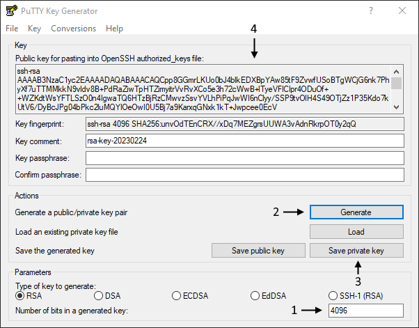

# Практическое задание 2. Организация удалённого доступа в OC Linux

**Цель:** Ознакомиться на практике со средствами удаленного входа в систему. Приобрести опыт и навыки управления удаленным доступом посредством *ssh*.

Каждую выполненную вами команду и результат её работы поместите в отчёт в виде скриншота. Подпись к скриншоту должна содержать номер соответствующего пункта задания.

## Подготовка к практическому занятию

1. Создайте новую виртуальную машину и установите *Ubuntu Desktop* или используйте существующую. Образ можно скачать на официальном [сайте](https://ubuntu.com/download/desktop). В процессе установки можно оставить настройки по умолчанию. Если установить Дополнения гостевой ОС, то виртуальная машина будет работать лучше.

   ❗ В процессе установки укажите **уникальное** имя пользователя (может совпадать с именем выбранным для *Ubuntu Server*).
   
2. Переключите настройки сети для *Ubuntu Server* и *Ubuntu Desktop* в режим "Сетевой мост";


## Задания к практической работе

### Введение

*SSH* (*Secure Shell* - безопасная оболочка) -  это сетевой протокол для безопасного удаленного входа в систему и безопасной передачи данных по НЕбезопасной сети. *SSH* работает по модели клиент-сервер, что подразумевает наличие *ssh*-клиента на одной машине и *ssh*-сервера на другой. Чтобы обеспечить безопасность в *SSH* предусмотрены механизмы аутентификации клиента и сервера, а так же шифрования информации, которой они обмениваются. 

<p align="center"></p>

Существует множество как платных, так и бесплатных программ поддерживающих протокол *SSH*.  В практической работе, в основном, будут рассмотрены утилиты из набора *[OpenSSH](https://ru.wikipedia.org/wiki/OpenSSH)*, т.к. они бесплатные и широко распространены.

### Проверяем серверную машину

В качестве серверной машины (к которой хотим подключаться), будем использовать виртуальную машину с *Ubuntu Server*. Машина с *Ubuntu Desktop* понадобится ближе к концу работы.

1. Убедитесь, что на сервере установлен *ssh*-сервер:

   ```bash
   sshd -V  # верися сервера (OpenSSH Daemon)
   ```
   
   Буква `d` обычно, означает, что программа является демоном. В *Linux* демонами называют программы, которые работают в фоновом режиме без прямого взаимодействия с пользователем и как правило выполняют служебные функции.
   
   Если вы получили сообщение об ошибке, значит *ssh*-сервер не установлен. В этом случае установите его командой ([подробнее](https://losst.pro/ustanovka-ssh-ubuntu-16-04)):
   
   ```bash
   sudo apt install openssh-server
   ```

2. Т.к. демон *ssh* поставляется в виде службы, то им удобно управлять через утилиту `systemctl` (*ctl* сокращение от *control*). Убедитесь, что *ssh*-сервер запущен: 

   ```bash
   systemctl status ssh # в некоторых системах: systemctl status sshd
   ```

   Вывод должен быть примерно такой:

   <p align="center"></p>

   В графе *Active:* указано *inactive* - это говорит, о том, что служба **выключена**, но она будет автоматически запущена в том случае, если кто-то попробует установить входящее соединение (*TriggersdBy: ssh.socket*). После этого демон продолжит работать на постоянной основе (такой подход называется *socket-based activation*).

   В графе *Loaded* указан путь к файлу в котором описана служба; значение *preset: enabled* - говорит, что по умолчанию, служба добавляется в автозагрузку после установки, но *disabled* перед ним - говорит, что на данный момент, автозагрузка службы, во время старта системы, отключена.

   <details>
       <summary>До версии <i>Ubuntu 22.10</i></summary>
       <p>До версии <i>Ubuntu 22.10</i>, демон запускался сразу, в процессе загрузки операционной системы, и постоянно занимал место в памяти, даже если по <i>ssh</i> к машине никто никогда не подключался. Поэтому, в новых дистрибутивах <i>Ubuntu</i>, отключили автозагрузку демона и перешли на <i>socket-based activation</i>. Для провайдеров облачных решений экономия нескольких мегабайт на каждой виртуальной машине может быть очень существенной, т.к. у них таких машин тысячи.</p>
       <p>Для <i>Ubuntu</i> до версии 22.10 и для других дистрибутивов <i>Linux</i> статус службы сразу будет такой:</p>
       <p align="center"></p>
   </details>

### Проверяем клиентскую машину

В качестве клиентской машины, пока что будем использовать вашу основную ОС. Далее будем называть её хостовой машиной (от слова *host* - хозяин).

Если у вас *Linux* или *MacOS*, то можно воспользоваться стандартной утилитой `ssh`, она как правило включена в большинство дистрибутивов.

Для *Windows* ситуация следующая:

- Начиная с *Windows 10* (сборка 1809) или *Windows Server 2019* в системе присутствует компонент *OpenSSH* (хотя может быть отключён), поэтому в ней присутствуют все утилиты из этого набора (т.е. такие же как и в *Unix* системах). Поэтому вы можете воспользоваться утилитой `ssh` которая доступна через терминал *cmd* или *PowerShell*;
- Для более старых версий *Windows*:
  - Установить утилиту [`git`](https://git-scm.com/) и в комплекте с ней, обычно устанавливается терминал, который можно открыть через пункт контекстного меню "*Git Bash Here*". В этом терминале тоже доступен стандартный *ssh*-клиент из комплекта программ *OpenSSH*;
  - Использовать любой другой *ssh*-клиент, например *PyTTY*, *KiTTY* и другие.


3. Откройте любой терминал (на хостовой машине) и введите:

   ```bash
   ssh -V  # версия клиента (OpenSSH Client)
   ```
   
   Если вы получили сообщение об ошибке, значит у вас не установлен *ssh*-клиент, в этом случае установите его командой:
   
   ```bash
   sudo apt install openssh-client
   ```
   
   Если у вас *Windows 10* или старше, но вы получили сообщение об ошибке, значит у вас отключён нужный компонент и его необходимо [включить](https://csatlas.com/install-ssh-client-windows-10/).

### Подключаемся к виртуальной машине по SSH

4. Введите команду на *Ubuntu* *Server*:

   ```bash
   ip a  # ip address
   ```

   В результате вы получите список сетевых интерфейсов и их *IP*-адресов. В моём случае у виртуальной машины такой *IP*:

   <p align="center"></p>

5. Проверьте, что виртуальная машина доступна с хостовой при помощи утилиты `ping`:

   ```bash
   ping 192.168.1.62
   ```

   Здесь и далее вместо `192.168.1.62` используйте *IP*-адрес **своей** виртуальной машины.

   Вообще говоря можно пропинговать и в обратную сторону, но в случае, если вы работаете на *Windows 8* и старше, то настройки по умолчанию запрещают *Windows* отвечать на *ping*-запросы. При желании вы можете эту блокировку [отключить](https://help.keenetic.com/hc/ru/articles/213966229-Отключение-блокировки-ответа-на-ping-запросы-в-ОС-Windows-8-10).

   Получить список сетевых интерфейсов и их *IP*-адреса в *Windows* можно командой `ipconfig`.

6. На виртуальной машине запустите команду:

   ```bash
   watch -n 0.5 pstree -p
   ```

   Изучите список процессов. На текущий момент среди них не должно быть *sshd*. Как мы видели выше, демон ещё не запущен.

7. На хостовой системе, в командой строке запустите команду:

   ```bash
   ssh boss@192.168.1.62
   ```

   Здесь мы используем утилиту [`ssh`](https://manpages.ubuntu.com/manpages/plucky/en/man1/ssh.1.html) для подключения к удалённой машине с *IP*-адресом `192.168.1.62` под пользователем *boss* (здесь и далее используйте имя своего пользователя). Выражение `boss@192.168.1.62`, согласно документации, называется *destination* (пункт назначения). 

   В этот момент в списке процессов должен появиться *sshd*, т.к. система приняла подключение и, как было указано в настройках службы, запустила демон.

8. Если подключение будет установлено успешно, то вы увидите предупреждение, о том, что вы первый раз подключаетесь к указанному хосту и вопрос, действительно ли мы уверены, что это тот самый компьютер, к которому мы хотим подключиться. Ответьте согласием (нужно ввести *yes* полностью) и в дальнейшем это предупреждение не будет выводиться, т.к. клиент запомнит указанный хост.

   <p align="center"></p>

9. У вас запросят пароль от пользователя *boss*. Введите его.

   Если всё прошло успешно, вы должны увидеть приветственное сообщение и изменение приглашения к вводу. Теперь все ваши команды будут выполняться на виртуальной машине. Если пароль долго не вводить, то вам могут отказать в подключении.

10. Введите команду:

    ```bash
    ls -la
    ```

    В результате вы получите список файлов своего пользователя на виртуальной машине, в его домашнем каталоге (по умолчанию, при подключении попадаем в домашний каталог пользователя).

11. Откройте ещё один терминал на хостовой машине и подключитесь к виртуальной по *ssh*.

    Как видно, теперь у вас запросили только пароль, т.к. сервер уже знаком. В тоже время в дереве процессов от корневого процесса *sshd* отходят 2 дочерних, в каждом из которых запущена оболочка *bash*. Каждое новое подключение по *ssh* является дочерним процессом демона *sshd*.

12. Введите в одном из терминалов команду:

    ```bash
    exit
    ```

    В результате вы отключитесь от виртуальной машины и один из дочерних процессов *sshd* исчезнет.

    Окно терминала можно закрыть.

13. В оставшемся окне введите сочетание клавиш <kbd>Ctrl</kbd>+<kbd>D</kbd>.

    В результате вы тоже отключитесь от виртуальной машины, а в дереве процессов останется только один корневой `sshd`. После того, как демон проснулся, он будет постоянно висеть и слушать входящие соединения.

14. На виртуальной машине остановите команду `watch` и затем введите:

    ```bash
    systemctl status ssh
    ```

    В результате вы должны увидеть что-то типо такого:

    <p align="center"></p>

    Здесь мы видим, что демон запущен, а также можно посмотреть информацию о времени запуска, потреблении памяти, ресурсов процессора, путь к программе, а снизу показаны несколько последних строк логов из которых понятно, что сервер слушает на 22 порту и только что были 2 сессии от пользователя *boss* который подключался с *IP*-адреса `192.168.1.38` (это *IP* моей хостовой машины).

Иногда нужно выполнить команду на сервере и получить результат в текущем терминале на клиентской машине, без перехода в оболочку удалённый машины. Это можно сделать, если указать команду и её параметры после пункта назначения. Команда будет выполнена на сервере без перехода в сеанс, а её вывод распечатается в текущей оболочке. 

15. В терминале хостовой машины выполните команду:

    ```bash
    ssh boss@192.168.1.62 ls -la  # или ssh boss@192.168.1.62 "ls -la"
    ```

    В результате вы увидите тот же вывод, что и ранее, но останетесь в текущей оболочке. Опции команд можно вводить как обычно, через пробел после команды (в данном случае `-la` это опции `ls`, а не `ssh`). Будьте внимательны со спец символами (например: `~`, `*` и т.д.), т.к. они будут подставлены текущей оболочкой, а не оболочкой сервера. Т.е. `~` в команде будет означать путь к домашнему каталогу текущего пользователя, а не `boss`. Чтобы избежать такой путаницы, команду и её аргументы можно взять в кавычки, тогда разрешение символов будет уже на стороне сервера.

16. Выполните команду:

    ```bash
    ssh boss@192.168.1.62 nano test.txt
    ```

    Здесь мы хотим запустить на удалённой машине текстовый редактор `nano` и открыть в нём файл `"test.txt"`. В результате текстовый редактор так и не откроется. Это произошло, т.к. некоторым программам (интерактивным) для работы нужен терминал на стороне сервера. В режиме выполнения команд, `ssh` не создаёт терминал, а просто перенаправляет стандартный поток ввода на сервер, а поток вывода сервера к нам.

17. Выполните команду:

    ```bash
    ssh -t boss@192.168.1.62 nano test.txt
    ```

    В данном случае мы используем опцию `-t`, которая перед запуском команды (в нашем случае `nano test.txt`) выполнит запуск терминала, а после того как команда отработает, *ssh* автоматически закроет терминал и соединение. Не путайте с опцией `-T` - она наоборот запрещает создание терминала.

    Заметьте, что опции относящиеся к самой утилите `ssh` указываются **перед** пунктом назначения.

18. Закройте `nano`.

    В нижней части редактора перечислены комбинации клавиш. Символ `^` в начале комбинации означает <kbd>Ctrl</kbd>, а `M-`  <kbd>Alt</kbd>. Таким образом, чтобы выйти нажмите <kbd>Ctrl</kbd> +  <kbd>x</kbd>. Если вы внесли изменения в файл, то нажмите <kbd>n</kbd>, чтобы отказаться от сохранения.

Таким образом, общий формат запуска утилиты `ssh` имеет следующий вид:

```bash
ssh [опции_ssh] destination [команда [опции_команды]]
```

из перечисленного обязательным является только пункт назначения, всё, что в квадратных скобках указывается при необходимости.

Пункт назначения может быть задан в одной из следующих форм:

```bash
[user@]hostname
ssh://[user@]hostname[:port]  # URI форма
```

### Конфигурационный файл ssh-клиента

Работа *ssh*-сервера и *ssh*-клиента зависит от множества параметров. Итоговые значения этих параметров определяется в следующем порядке:

- Значения параметров переданные непосредственно в командной строке;
- Значения параметров из конфигурационных файлов (сначала пользовательского, затем глобального). В [документации](https://manpages.ubuntu.com/manpages/focal/man5/ssh_config.5.html) подробно описана работа *ssh*-клиента с конфиг-файлами и назначение каждого параметра;
- Значения параметров по умолчанию;

Обратите внимание, что будет применено то значение, которое встретилось **первым**. Т.е., если в конфиге указать несколько раз значение параметра, то будет использовано первое, а второе будет проигнорировано, поэтому значения заданные в пользовательском конфиге приоритетнее тех, что указаны в глобальном (т.к. пользовательский загружается первым).

Чтобы посмотреть значения всех параметров, которые в итоге будет использованы *ssh*-клиентом нужно в строке подключения добавить опцию `-G`.

19. В терминале хостовой машины выполните команду:

    ```bash
    ssh -G boss@192.168.1.62
    ```

    Как видно, вместо подключения к виртуальной машине, на экране появился список параметров и их значений. Т.к. их довольно много, то для поиска нужного удобно использовать утилиту `grep` (или `find` в *cmd* и *PowerShell*).

20. Выполните команду (в зависимости от своей оболочки) и найдите значение параметра `pubkeyauthentication`:

    ```bash
    ssh -G boss@192.168.1.62 | grep -i auth     # для bash
    ssh -G boss@192.168.1.62 | find /i "auth"   # для cmd
    ssh -G boss@192.168.1.62 | find /i '"auth"' # для PowerShell
    ```

    Опция `-i`, чтобы не задумываться о регистре.

21. Выполните команду (здесь и далее используйте `find` вместо `grep` если нужно):

    ```bash
    ssh -G -o PubkeyAuthentication=no boss@192.168.1.62 | grep -i auth
    ```

    Как видно, значение параметра изменилось на *false*.

    Опция `-o` позволяет задать значение одного параметра *ssh*-клиента в командной строке. Опция может быть указана необходимое количество раз. Для некоторых параметров существуют свои собственные опции *ssh*, в этом случае они приоритетнее, чем заданные при помощи `-o`. Например, для: `-p 44 -o "port=88"` результат будет 44-й порт.

    Как видно, имя параметра не зависит от регистра. И в конфиг-файле и в командной строке для имени можно использовать любой регистр. В тоже время, само значение - зависит от регистра.  
    Значение параметра может быть задано через пробел после имени или знак `=` (последний вариант удобен для командной строки, чтобы не писать лишние кавычки, т.к. пробел в командной строке - это разделитель аргументов команды).

22. Выполните команду:

    ```bash
    ssh -G -v boss@192.168.1.62
    ```

    Опция `-v` позволяет получить подробный (*verbose*) вывод действий, которые выполняет *ssh*-клиент в процессе работы (можно сделать вывод ещё более подробным повторив эту опцию до 3-х раз).

    Перемотайте вывод к началу.

    В данном случае мы увидим откуда и в каком порядке загружаются конфиг-файлы. Стандартное их расположение:

    - Пользовательский. В рабочем каталоге пользователя: `"~/.ssh/config"` на *Linux* и `"%userprofile%\.ssh\config"` на *Windows*;
    - Глобальный. В каталоге `"/etc/ssh/ssh_config"` на *Linux* и `"%programdata%\ssh\ssh_config"` на *Windows*.

    Запустив *ssh*-клиент с опцией `-F`, можно указать путь к альтернативному конфиг-файлу, в этом случае будет использоваться только он. Если вместо пути указать `none`, то *ssh*-клиент вообще не будет использовать конфиг-файлы.

23. Откройте пользовательский конфиг-файл на хостовой машине в текстовом редакторе и добавьте в начало (у вас могли остаться старые записи, например, если вы подключались по *ssh* через *VS Code*):

    ```bash
    Host server
      # Укажите своё имя пользователя
      User boss
      # Укажите IP своего сервера
      HostName 192.168.1.62
    ```

    Здесь создаётся секция `Host` в которой указаны параметры, которые будут применены только для этого хоста. Секция действует до начала следующей секции `Host` или `Match`. Отступы перед параметрами не обязательны, они исключительно для визуальной наглядности. Таким же образом можно указать и остальные параметры *ssh*-клиента для любого количества машин.

    Текст идущий после символа `#` и пустые строки воспринимаются как комментарий. Комментарий обязательно должен быть в отдельной строке.

24. Выполните команду:

    ```bash
    ssh -G -v server
    ```

    Как указано в выводе, после загрузки пользовательского конфига, были применены параметры указанные в блоке для хоста *server*.

    <p align="center"></p>

    Эта информация особенно полезна, когда конфиг-файл содержит большое количество блоков с более сложными шаблонами сопоставления и не всегда понятно какие из них отработали и в каком порядке.

25. Выполните команду:

    ```bash
    ssh server
    ```

    Как видно *ssh*-клиент подключился к нужному серверу под нужным пользователем без явного указания этих данных в командной строке.

    Отключитесь от виртуальной машины.

26. Внесите изменения в конфиг:

    ```bash
    Host 192.168.1.62 server? !server5 *.com
      # Укажите своё имя пользователя
      User boss
      # Укажите IP своего сервера
      HostName 192.168.1.62
    ```

    Теперь после `Host` указано несколько имён через пробел. Это шаблоны, с которыми будет сравниваться *hostname* указанный в командной строке:

    - Первый шаблон `192.168.1.62` отработает в случае полного совпадения с *hostname*;

    - Второй, в случае, если *hostname* будет начинаться на `server`, а затем будет ровно один любой символ;

    - Последний шаблон отработает, если *hostname* будет равен `.com` или будет заканчиваться на `.com`;

    - Четвёртый шаблон - исключающий. Если будет совпадение с ним, то совпадение с другими шаблонами игнорируется. Важно понимать, что если ваш *hostname* НЕ совпадает с исключающим шаблоном, то это не означает, что блок подходит. Например, если *hostname* это `server1`, а блок задан так:

      ```bash
      Host !server5
        # Какие-то параметры
      ```

      то это не означает, что мы попадём в этот блок. Сюда никто не попадёт, т.к. нет разрешающих шаблонов. Если исправить на:

      ```bash
      Host !server5 server1
        # Какие-то параметры
      
      # или
      
      Host !server5 *
        # Какие-то параметры
      ```

      в этом случае совпадение будет.

27. Попробуйте подключиться каждым из следующих способов (на этапе запроса пароля можно нажать <kbd>Ctrl</kbd>+<kbd>C</kbd>. Здесь главное посмотреть поймёт ли клиент куда подключаться):

    ```bash
    ssh 192.168.1.62  #1
    ssh server        #2
    ssh server1       #3
    ssh server2       #4
    ssh server5       #5
    ssh google.com    #6
    ```

    Как видно, для варианта (2) в конфиге нет совпадений, а для варианта (5) совпадение есть, но блок был проигнорирован из-за исключающего шаблона.

28. Внесите изменения в конфиг:

    ```bash
    Host server
      # Укажите IP своего сервера
      HostName 192.168.1.62
      
    Host *
      # Укажите своё имя пользователя
      User boss
    ```

    Если у вас несколько блоков `Host`, то будет проверяться совпадение с каждым из них в порядке их появления в конфиге. При каждом совпадении вы будете "проваливаться" в блок и забирать оттуда **новые** параметры. Параметры которые встречались ранее менять своё значение НЕ будут.

    В данном случае, с последним шаблоном совпадёт абсолютно любой *hostname*, поэтому, если пользователя явно не указать в командной строке, то по умолчанию, для всех хостов будет вход под пользователем `boss`. Блок `*` обычно добавляют в самый низ конфига, чтобы он отработал последним (своего рода значения по умолчанию).

    Пустая строка между блоками - исключительно для визуальной наглядности. Всё, что находится между блоком `server` и блоком `*` принадлежит блоку `server`, пустые строки между записями  игнорируются как комментарии.

29. Выполните команды:

    ```bash
    ssh -G -v server
    ssh -G -v master@server
    ssh -G -v google
    ```

    И посмотрите, как менялись значения параметров `User` и `HostName`.

Кроме блока `Host` можно группировать параметры в блоках `Match`. Поведение блока `Match` в целом идентично поведению блока `Host`, с той разницей, что блок `Match` проверяет выполнение одного или нескольких условий одновременно.  В блоке `Match` можно проверять только определённые критерии, например: имя пользователя, имя хоста и т.д. ([подробнее](https://man.openbsd.org/ssh_config#Match)).

30. Внесите изменения в конфиг:

    ```bash
    Host server
      HostName 192.168.1.62
      User boss
    
    # Аналог: Host apple.com
    Match host apple.com
      User steve
      
    Match user sergey host google.com
      Port 1337
    ```
    
31. Выполните команды:

    ```bash
    ssh -G -vv server
    ssh -G -vv apple.com
    ssh -G -vv sergey@google.com
    ```
    
    Здесь мы указываем опцию `-v` дважды, чтобы увидеть обработку секций `Match`.
    

Параметры также можно указывать на глобальном уровне (вне секций `Host` или `Match`), но только в самом верху (если написать их внизу, то они попадут в последний блок). Находясь вверху такие параметры  встретятся первыми, поэтому их значения уже не будут изменены. Своего рода обязательные настройки, которые нельзя изменять независимо от условий.

32. Модифицируйте пользовательский конфиг на хостовой машине следующим образом:
    - Удалите все ранее созданные секции;
    - Создайте секцию `Host server`, для подключения к виртуальной машине с *Ubuntu Server*. В секции укажите нужные для подключения параметры;
    - Создайте секцию `Host vps`, для подключения к *VPS*. В секции укажите нужные для подключения параметры (доступны [тут](https://moodle.cfuv.ru/pluginfile.php/1479522/mod_resource/content/2/VPS.pdf)).

### Конфигурационный файл ssh-сервера

В целом параметры *ssh*-сервера определяются таким же образом как и для *ssh*-клиента, но есть и отличия:

- Для сервера существует только глобальный конфиг, а пользовательского нет;
- Нет блоков `Host`, только глобальный уровень и блоки `Match`;
- Для *ssh*-**клиента** значение параметра определяется только один раз и не может быть переопределено, независимо от того где оно указано. Для **сервера** ситуация немного меняется. Если на глобальном уровне указать параметр несколько раз, то будет использовано первое значение, но если оно будет указано ещё и в блоке `Match`, то оно **переопределит глобальное**, но если оно будет указано в нескольких блоках `Match`, то будет использовано значение из первого блока `Match`.

33. Подключитесь к виртуальной машине по *ssh* и выполните команду:

    ```bash
    sudo sshd -G -dd
    ```

    Здесь мы выполняем запуск *ssh*-демона (один уже работает, это второй), но благодаря опции `-G` работа демона прерывается после вывода параметров. Опция `-d` (*debug*) аналогична опции `-v` для клиента и служит для вывода дополнительной информации.

    Как видно, вначале загружается файл `"/etc/ssh/sshd_config"`. Обратите внимание, что на серверной машине также установлен *ssh*-клиент и его глобальный конфиг лежит в этом же каталоге, но называется `ssh_config`. Не путайте их.

    В  `"sshd_config"`, в самом начале указана команда `Include /etc/ssh/sshd_config.d/*.conf`, что приводит к загрузке всех файлов из каталога `"sshd_config.d"` и вставке их в основной конфиг. Благодаря тому, что они вставляются в начало, параметры из этих файлов будут применены раньше тех, что прописаны в основном конфиге. Создания каталога `".d"` с дополнительными конфигами это типичный случай для *Linux*, позволяющий менять настройки программы не внося изменения в основной конфиг-файл.

34. Для начала выполним базовые настройки безопасности *ssh*-сервера. Для этого отредактируем конфигурационный файл `"/etc/ssh/sshd_config"`. Откройте его в любом текстовом редакторе (через `sudo`):

    - Довольно часто боты сканируют 22 порт на наличие ответа от *ssh*-сервера и пытаются подобрать пароль к нему по базе самых популярных паролей. Изменим порт для подключения по *ssh* на любой свободный, например на 6543. Это не спасёт нас от взлома, если этого сильно захотят, но зато мы не будем тратить ресурсы нашего сервера на установку "мусорных" подключений со случайными ботами. При необходимости, можно указать несколько портов повторив соответствующий параметр несколько раз (в данном случае будет не переопределение, а добавление).

      <details>
        <summary>Для Ubuntu 22.04.</summary>
          <p>Для этого найдите строку <code>#Port 22</code>, уберите символ <code>#</code> и укажите выбранный порт.</p>
      </details>
      <details>
        <summary>Для Ubuntu 22.10 и новее.</summary>
          <p>Как было сказано ранее, начиная с версии Ubuntu 22.10 в работу ssh сервера было внесено изменение. Из-за перехода на <i>socket-based activation</i> параметры <code>Port</code> и <code>ListenAddress</code> теперь настраиваются НЕ в файле sshd_config. Изменения этих параметров в sshd_config будут проигнорированы. Все остальные параметры, как и ранее настраиваются в sshd_config.</p>
          <p>По умолчанию, ssh сервер ожидает подключение по 22 порту и любому из доступных сетевых интерфейсов (сетевых карт). Чтобы указать IP сетевого интерфейса и/или порт нужно:</p>
          <ul>
              <li>Перейти в каталог <code>/usr/lib/systemd/system</code></li>
              <li>В нём октрыть для редактирования файл <code>ssh.socket</code></li>
              <li>В файле, в секции <code>[Socket]</code> прописать параметр <code>ListenStream=6543</code> чтобы ssh сервер слушал порт 6543 на всех сетевых интерфейсах или <code>ListenStream=127.0.0.1:6543</code> тогда порт 6543 будет прослушиваться только на интерфейсе с IP <code>127.0.0.1</code>. Вместо <code>127.0.0.1</code> нужно указать IP который доступен извне, иначе к машине нельзя будет подключиться. Параметр <code>ListenStream</code> может быть указан несколько раз.<br>
                  В нашем случае, в секции <code>[Socket]</code> нужно написать:<pre>
      ListenStream=
      ListenStream=6543</pre>
              Первый, пустой <code>ListenStream</code> нужен, чтобы обнулить настройки по умолчанию. Без этой строки, по ssh можно будет подключиться и по 6543 и по 22 порту.</li>
          </ul>
      </details>

    - Запретим устанавливать связь по протоколу версии 1.  
      Для этого добавьте: `Protocol 2`.

    - В *Ubuntu*, по умолчанию, мы не сможем сразу подключится по *ssh* как пользователь *root* с использованием пароля (т.к. для *root* пароль не задан), но в других дистрибутивах такая возможность есть. Поэтому, на всякий случай, вообще отключим возможность подключения по *ssh* для *root*, хоть по паролю, хоть по чему угодно другому.  
      Для этого найдите:  `#PermitRootLogin prohibit-password` и замените на `PermitRootLogin no`.

    - Иногда пользователям очень удобно создавать пустые пароли, чтобы не запоминать сложные пароли. Такая практика может нанести ущерб безопасности вашего сервера. Следовательно, вам необходимо отклонить все попытки аутентификации с пустыми паролями.  
      Для этого найдите:  `#PermitEmptyPasswords no` и уберите `#`.

    Сохраните файл.

35. Выполните команду:

    ```bash
    sudo sshd -t
    ```

    Опция `-t` выполняет проверку конфига и сообщает об ошибках, если таковые будут найдены, поэтому если вывод будет пустой, то значит тестовый запуск *ssh*-сервера прошёл успешно и в конфиге ошибок нет. Чтобы протестировать конфигурацию из нестандартного файла-конфига можно указать путь к нему после опции.

36. Добавьте в конец `sshd_config`:

    ```bash
    # Укажите имя своего пользователя
    Match User boss
      # Укажите IP хостовой машины
      AllowUsers *@192.168.1.38
    ```

    Как и для *ssh*-клиента `Match` создаёт блок, который действует до конца файла или до следующего блока `Match`. В данном случае эти параметры будут применены, если подключение по *ssh* будет выполняться под пользователем *boss*.

    Изучите описание параметра [`AllowUsers`](https://man.openbsd.org/sshd_config#AllowUsers). Что будет, если указать его на глобальном уровне?

37. Выполните команды:

    ```bash
    sudo sshd -T | grep -i allow
    sudo sshd -d -T -C "user=boss" | grep -i allow
    ```

    Опция `-T` работает так же как и `-t` и `-G` вместе, но дополнительно позволяет указать опцию `-C`. Опция `-C` (*connection*) позволяет посмотреть параметры, которые будут использованы при подключении с конкретного хоста под конкретным пользователем и т.д. (т.е. в выводе учитываются блоки `Match`).

38. На текущий момент конфигурация ещё не вступила в силу, т.к. *sshd* не знает об изменениях конфигурационного файла. Чтобы заставить *sshd* перечитать конфиг введите команду:

    ```bash
    sudo systemctl reload ssh
    ```

    В этом случае демон прочитает и применит конфиг без перезапуска, при этом те, кто уже подключён отключены НЕ будут.

    Для *Ubuntu 22.04* и старше этого было бы достаточно, т.к. все настройки хранились в `sshd_config`, но для более новых версий (как мы помним) настройки порта и слушающих интерфейсов вынесены в другой файл, поэтому на текущей момент применились все настройки кроме них.

39. Выполните команду:

    ```bash
    sudo systemctl daemon-reload
    sudo systemctl restart ssh.socket
    ```

    Здесь мы просим `systemctl` прочитать заново настройки всех сервисов, а затем перезапускаем `ssh.socket`, чтобы старый сокет больше не принимал входящие соединения, а запустился новый.

40. Отключитесь от виртуальной машины и попробуйте подключится по 22 порту и по порту 6543:

    ```bash
    ssh server
    ssh -p 6543 server
    ```

    В первой команде используется порт по умолчанию 22, во второй мы меняем его при помощи опции `-p`.

41. На хостовой машине внесите параметр `Port` в пользовательский конфиг-файл *ssh*-клиента и попробуйте подключится заново без явного указания порта в командной строке.

    Отключитесь от виртуальной машины.

<br>

### Обмен файлами с удалённым сервером

При подключении через *ssh*-клиент вы можете выполнять команды на удалённом сервере, в том числе создавать/удалять/перемещать файл. Но всё это будет происходить в пределах сервера. Периодически возникает необходимость отправить файлы с локальной машины на удалённую или наоборот забрать что-то с сервера себе, при этом безопасным способом.

#### Простое копирование (scp)

В состав набора утилит *OpenSSH* входит утилита [`scp`](https://losst.pro/kopirovanie-fajlov-scp) (*Secure Copy*). Она создаёт шифрованный *ssh*-туннель и передаёт данные внутри него, тем самым обеспечивая безопасный обмен файлами между локальной и удалённой машиной или между двумя удалёнными.

Утилита `scp` использует те же параметры, что и `ssh`-клиент, определяет их в том же порядке и использует те же конфигурационные файлы. Опция `-o` позволяет указать параметр в командной строке, а `-F` указать альтернативный конфиг-файл.

Как указано в [документации](https://manpages.ubuntu.com/manpages/oracular/en/man1/scp.1.html), утилита `scp` требует передавать ей данные в следующем виде:

```bash
scp [опции_scp] источникИ приёмник
```

Источников (*source*) может быть один или несколько, но приёмник (*target*) всегда один. То, что указано последним и будет восприниматься как приёмник, всё, что перед ним - как список источников. Если источников больше одного, то приёмником обязательно должен быть каталог.

Утилита `scp` позволяет копировать файлы в любом направлении (локальный - удалённый, удалённый - локальный, удалённый - удалённый), главное в правильном порядке указать источник и приёмник.

42. На хостовой машине создайте файл `"get_info.py"` со следующим содержимым: 

    ```python
    import platform
    print(platform.uname())
    ```

    Я создам его на рабочем столе.

43. На *хостовой* машине откройте терминал, перейдите в каталог с файлом и воспользуйтесь утилитой `scp`, чтобы скопировать файл `"get_info.py"` с хостовой машины на виртуальную:

    ```bash
    scp -P 6543 get_info.py boss@192.168.1.62
    ```

    В текущем виде команда выполнит НЕ то, что нам нужно. Вместо копирования файла на сервер, будет создана локальная копия файла, т.е в текущем каталоге появится файл с именем `"boss@192.168.1.62"` являющийся копией `"get_info.py"`.

44. Исправьте команду следующим образом:

    ```bash
    scp -P 6543 get_info.py boss@192.168.1.62:  # в конце двоеточие
    ```

    Теперь команда выполнит копирование локального файла `"get_info.py"` из текущего каталога на сервер с *IP* `192.168.1.62` в домашний каталог пользователя *boss*. Для утилиты `scp` наличие двоеточия после имени/адреса хоста обязательно.

    Обратите внимание, что порт задаётся опцией `-P` в верхнем регистре, тогда как для `ssh` порт задавался `-p` в нижнем регистре.

    Утилита `scp` использует тот же конфиг, что и `ssh`, поэтому эту же команду можно было записать так:

    ```bash
    scp get_info.py server:
    ```

    Если соединение установится успешно, вы увидите информацию о процессе копирования файлов.

45. Проверьте, что файл `"get_info.py"` появился на сервере и его содержимое соответствует исходному. Кроме того, проверьте права и владельца файла.

46. В терминале хостовой машины выполните команду:

    ```bash
    scp server:get_info.py vps:info.py
    ```

    В результате у вас запросят пароль от машины-приёмника (в нашем случае *vps*), а затем от всех источников в порядке их следования в команде (в нашем случае только от виртуальной машины).

    Здесь мы копируем файл `"get_info.py"` из домашнего каталога вашего пользователя на виртуальной машине в домашний каталог вашего пользователя на *vps*, при этом имя файла будет изменено на `"info.py"`.

    Копирование файла происходит через локальную машину (опция `-3` - работает по умолчанию). Можно изменить это поведение при помощи опции `-R` (*remote*), в этом случае копирование будет происходить напрямую с виртуальной машины на *vps* и следовательно будет быстрее. Однако, в этом случае, команда `scp` будет запущена на машине-источнике и следовательно она должна иметь доступ к машине-приёмнику и иметь возможность авторизоваться на ней без пароля (например по ключу).

47. Проверьте, что файл `"info.py"` появился на *vps* и его содержимое соответствует исходному. Кроме того, проверьте права и владельца файла.

48. Запустите скрипт на виртуальной машине и на *vps*, при этом результат его работы перенаправьте в файл:

    ```bash
    python3 get_info.py > log_server.txt  # на виртуальной машине
    python3 info.py > log_vps.txt         # на vps
    ```

    Отключитесь от машин.

49. В терминале хостовой машины выполните команду:

    ```bash
    mkdir data
    scp server:log_server.txt vps:log_vps.txt data
    ```

    Здесь мы создаём на хостовой машине каталог `"data"` и копируем туда файлы с виртуальной машины и с *vps*.

50. В терминале хостовой машины выполните команду:

    ```bash
    scp -r data server:logs
    ```

    Здесь мы копируем на виртуальную машину каталог `"data"` (и его содержимое) под именем `"logs"`. Т.к. мы работаем с каталогами, поэтому обязательно нужно указать опцию `-r`. Не имеет значения копируется каталог с сервера или на сервер.

51. Убедитесь, что на виртуальной машине появился каталог `"logs"` и в нём есть 2 файла.

52. В терминале хостовой машины выполните команду повторно:

    ```bash
    scp -r data server:logs
    ```

    и проверьте содержимое каталога `"logs"`.

    Как видно, результат команды отличается от предыдущего. Первый раз, каталога `"logs"` не существовало, поэтому мы получили копию локального каталога, но под новым именем. Во второй раз, каталог `"logs"` уже был, поэтому он был использован как каталог назначения на сервере и `"data"` был скопирован в него.

    Если вы хотите выполнить копирование именно в какой-то конкретный каталог, но не знаете существует он или нет, то добавьте после имени каталога `/` (например: `logs/`). Если бы мы так сделали для первой команды, то получили бы ошибку, т.к. каталога `"logs"`, на тот момент, ещё не было.

    Если вы хотите скопировать не сам каталог, а его содержимое, то добавьте после имени `/*` (например: `data/*`), чтобы скопировать всё или другой шаблон имени, для выборочного копирования.

    Заметьте, что всё это время мы использовали относительные пути: относительно **текущего** каталога на хостовой машине и относительно **домашнего** каталога пользователя на серверах. Если, после двоеточия вы укажите `/` (например: `/logs`), то путь будет считаться абсолютным, т.е. начинаться от корня диска.


#### Обмен файлами с сервером в интерактивном режиме (sftp)

Когда нужно что-то посложнее, чем просто скопировать файл/папку на сервер или обратно, то лучше воспользоваться утилитой [`sftp`](https://manpages.ubuntu.com/manpages/plucky/en/man1/sftp.1.html) (*Secure File Transfer Protocol*). Она тоже входит в комплект утилит *OpenSSH* и также обеспечивает безопасное копирование файлов по *ssh*-туннелю.

Утилита `sftp` использует те же параметры, что и `ssh`-клиент, определяет их в том же порядке и использует те же конфигурационные файлы. Опция `-o` позволяет указать параметр в командной строке, а `-F` указать альтернативный конфиг-файл.

53. В терминале хостовой машины выполните команду:

    ```bash
    sftp -P 6543 boss@192.168.1.62
    ```

    В результате вы должны подключится к виртуальной машине и попасть в интерактивную сессию `sftp`. Обратите внимание, что здесь порт, также как и у `scp`, указывается при помощи опции `-P` в верхнем регистре.

    Как уже было сказано выше `sftp` использует тот же конфиг, что и `ssh`, поэтому эту же команду можно было записать так:

    ```bash
    sftp server
    ```

54. Введите команду `help` (или `?`) и изучите справку по доступным в `sftp` командам.

    Как видно, здесь есть почти все команды, что и в обычном терминале. Обычные команды (например `ls`, `cd`) выполняются на удалённой машине, а команды с префиксом `l` (*local*) на локальной. Поэтому команда `ls` - покажет список файлов на удалённой машине, а `lls` - на локальной; аналогично команда `cd` - перейдёт в указанный каталог на удалённой машине, а `lcd` - на локальной.

55. Используйте команды:

    ```bash
    pwd
    lpwd
    ```

    Как видно, на сервере вы находитесь в домашнем каталоге пользователя (по умолчанию), а на локальной машине в той же папке, которая была текущей на момент подключения.

    Для `sftp`, в команде подключения можно указать каталог отличный от домашнего следующим образом:

    ```bash
    sftp server:path/to/dir
    ```

    Обратите внимание, что для утилиты `sftp` двоеточие после имени/адреса хоста обязательно только в случае изменения стартового каталога, в противном случае двоеточие НЕ ставится. Здесь, также как и для `scp`, путь без начального `/` считается относительно домашнего каталога пользователя.

56. Используя только `sftp` выполните действия:

    - На локальной машине создайте каталог `"sftp_test"` и перейдите в него;
    - Используйте команду `get`, чтобы скопировать файл `"get_info.py"` с виртуальной машины на локальную в текущий каталог;
    - Используйте команду `get`, чтобы скопировать каталог `"logs"` с виртуальной машины на локальную. Т.к. `"logs"` - это каталог, нужно указать опцию `-r`;
    - На локальной машине выйдите из каталога `"sftp_test"` на один уровень назад;
    - Используйте команду `put`, чтобы скопировать каталог `"sftp_test"`  с локальной машины на виртуальную. Опять же нужна опция `-r`;
    - Убедитесь, что каталог появился на сервере.

57. Завершите сеанс `sftp` командой `exit`.

<br>

### Туннелирование TCP-трафика

Рассмотрим ситуацию: у вас на сервере запущено приложение (например база данных), которое слушает входящие запросы на определённом порту. Вы хотите получить доступ к приложению с другой машины, но по некоторым причинам доступа к нужному порту у вас нет. Например: программа слушает на сетевом интерфейсе к которому нет доступа из вашей сети (например `127.0.0.1`); сетевыми политиками запрещены входящие соединения из вашей сети (порт закрыт); сама программа принимает входящие запросы только с определённых хостов; программа передаёт данные в открытом виде и существует риски перехвата и т.д.

<p align="center"></p>

Используя *ssh*-туннель мы можем безопасно обмениваться произвольным *TCP* трафиком с удалённой машиной, т.к. он будет зашифрован. Трафик входит с одной стороны туннеля и прозрачно выходит с другой, поэтому туннелирование трафика часто называют - проброс портов.

58. На хостовой машине создайте файл `"file_server.py"` содержащий:

    ```python
    import http.server
    import socketserver
    
    PORT = 8000
    IP = "127.0.0.1"
    
    Handler = http.server.SimpleHTTPRequestHandler
    
    with socketserver.TCPServer((IP, PORT), Handler) as httpd:
        print("Serving at port", PORT)
        httpd.serve_forever()
    ```

    Обратите внимание, что программа слушает на 8000 порту интерфейса `127.0.0.1`. Т.к.  `127.0.0.1` это внутренний интерфейс, то получить доступ к программе можно только с этой машины, но не через сеть.

59. Воспользуйтесь `scp` или `sftp`, чтобы скопировать `"file_server.py"` на виртуальную машину в домашний каталог вашего пользователя.

60. Запустите программу на сервере в фоне:

    ```bash
    python3 file_server.py &
    ```

    и проверьте, что она отвечает на запросы:

    ```bash
    curl 127.0.0.1:8000
    ```

61. Убедитесь, что параметр *ssh*-сервера `AllowTcpForwarding` установлен в `yes` иначе туннелирование трафика запрещено;

62. В терминале на хостовой машине выполните команды:

    ```bash
    curl 127.0.0.1:8000
    curl 192.168.1.62:8000 # используйте IP своего сервера
    ```

    В первой команде мы отправляем запрос на сетевой интерфейс `127.0.0.1`, но хостовой машины, а не виртуальной, поэтому результата нет. Во второй команде мы отправляем запрос на 8000 порт виртуальной машины, но и в этот раз ответа не будет. Так получается, потому что программа слушает запросы на другом сетевом интерфейсе.

63. В терминале на хостовой машине запустите команду:

    ```bash
    #      |    Вход     |    Выход    |
    ssh -L 127.0.0.1:8000:127.0.0.1:8000 server
    ```

    В результате, вы как и раньше подключитесь к серверу, но дополнительно между локальной и целевой машиной будет установлен *ssh*-туннель. При необходимости, можно повторить опцию `-L` нужное количество раз.

    Первая пара *IP* и порт соответствует локальной машине (вход в туннель), вторая пара *IP* и порт соответствует удалённой машине (выход из туннеля). Т.е. все запросы отправленные на `127.0.0.1:8000` локальной машины пройдут через туннель и выйдут на `127.0.0.1:8000` на виртуальной.

64. Откройте второй терминал на хостовой машине и выполните команду:

    ```bash
    curl 127.0.0.1:8000
    curl 192.168.1.62:8000 # используйте IP своего сервера
    ```

    В результате вы должны получить вывод для первой команды, а вторая команда по прежнему сообщит об ошибке.

65. Отключитесь от виртуальной машины в первой терминале, в результате закроется и *ssh*-туннель.

66. Определите *IP* хостовой машины и подключитесь к виртуальной такой командой:

    ```bash
    ssh -L <ip_хоста>:4040:127.0.0.1:8000 -L 127.0.0.1:8000:127.0.0.1:8000 server
    ```

    Во втором терминале проверьте результат:

    ```bash
    curl 127.0.0.1:8000
    curl <ip_хоста>:4040
    ```

    Как видно, теперь у нас два туннеля с разными точками входа на локальной машине, но одной точкой выхода на сервере.

67. Отключитесь от сервера в первом терминале и запустите следующую команду:

    ```bash
    ssh -L 0.0.0.0:4040:127.0.0.1:8000 server
    ```

    Во втором терминале проверьте результат:

    ```bash
    curl 127.0.0.1:4040
    curl <ip_хоста>:4040
    ```

    Как видно, оба туннеля работают нормально. Используя *IP* `0.0.0.0` мы создаём столько же туннелей, сколько у нас на локальной машине сетевых интерфейсов, при этом выход у всех один.

    Частом можно встретить форму записи без явного указания *IP* на локальной машине:

    ```bash
    -L *:4040:127.0.0.1:8000
    -L   4040:127.0.0.1:8000
    ```

    Результат работы данной формы зависит от значения параметра `GatewayPorts` (на клиенте). Если он равен `no` (значение по умолчанию), то вы получите вход только с `127.0.0.1`, если `yes` то к со всех сетевых интерфейсов (`0.0.0.0`)

68. Откройте конфиг-файл на хостовой машине и добавьте туда:

    ```bash
    Host server_tunnel
      HostName 192.168.1.62
      User boss
      Port 6543
      # Разрешаем слушать запросы на всех локальных интерфейсах
      GatewayPorts yes
      # Создаём туннель (можно указать несколько разных)
      LocalForward 4040 127.0.0.1:8000
      # Включаем сжатие
      Compression yes
    ```
    
69. В первом терминале переподключитесь к виртуальной машине при помощи команды:

    ```bash
    ssh server_tunnel
    ```

    В этот раз проверьте, что туннель работает через браузер:

    - Откройте браузер на хостовой машине;
    - В адресной строке напишите `127.0.0.1:4040`;
    - В адресной строке напишите `<ip_хоста>:4040`;

    Вывод должен быть в обоих случаях.
    
70. Отключитесь от сервера.


#### Прямой туннель 2

Рассмотрим следующую ситуацию: У вас в офисе, на вашей машине запущено приложение, к которому вы хотите получить доступ с домашнего компьютера. Прямого доступа из дома в офисную сеть у вас нет, но в офисе есть компьютер с *ssh*-сервером (назовём его *bastion*), который доступен из вашего дома и, в тоже время у этого компьютера есть доступ к вашей офисной сети.

<p align="center"></p>

В нашем случае, будем считать, что у хостовой машины нет прямого доступа к *vps*, но есть доступ к виртуальной машине (т.е. она будет *bastion*-ом). В тоже время, у виртуальной машины есть доступ к *vps*.

На *vps* запущено приложение на интерфейсе `<IP_vps>` и порту 33133.

71. На хостовой машине выполните команду:

    ```bash
    ssh -L 127.0.0.1:9000:<IP_vps>:33133 server
    ```

    В данном случае вход в туннель на локальном *IP* `127.0.0.1` и порту 9000, затем *ssh*-сервер получает запрос и открывает ещё одно соединение через случайной порт виртуальной машины на целевой порт 33133 и *IP* `<IP_vps>`.

    Тут важно заметить, что конечный пункт туннеля (в нашем случае *vps*) должен быть доступен для промежуточной машины (в нашем случае для виртуальной).

72. Откройте браузер на хостовой машине и в адресной строке введите `127.0.0.1:9000`.

    В результате вы должны получить картинку от *vps*. При этом трафик идёт по туннелю через виртуальную машину.

73. Отключитесь от сервера.

#### Прямой туннель 3

Расширим предыдущую ситуацию. Предположим, что теперь, вы хотите получить доступ к приложению из офиса но не только на компьютере с которого подключаетесь, но и например с телефона. Или возможно вы хотите показать своё приложение товарищу по команде, но без выдачи ему доступа к своей домашней машине. В этом случае, мы можем выбрать слушающий порт (вход в туннель) на внешнем интерфейсе локальной машины, который смотрит в нужную нам сеть.

<p align="center"></p>

74. Запустите туннель следующим образом:

    ```bash
    ssh -L 192.168.1.38:9000:<IP_vps>:33133 server
    ```

    В данном случае `192.168.1.38` - это *IP* моей хостовой машины. Этот *IP* был получен от роутера, следовательно, у любого устройства, которое подключено к этому же роутеру есть доступ к этому интерфейсу.

75. Возьмите любое другое устройство подключённое к тому же роутеру, что и ваша хостовая машина (телефон, ноутбук, ...), откройте браузер и введите в адресную строку:

    ```bash
    192.168.1.38:9000
    ```
    
    Теперь запрос идёт от вашего телефона/ноутбука через роутер на хостовую машину, проходит по туннелю на виртуальную машину и отправляется через интернет на *vps*. Ответ возвращается тем же путём.
    
76. Отключитесь от сервера.

#### Обратный ssh-туннель

Рассмотрим ситуацию обратную описанной выше. Вы находитесь в офисе и хотите получить доступ к приложению запущенному на домашнем компьютере. Напрямую вы не можете это сделать, хотя бы потому, что домашняя машина у вас не имеет белого *IP* и находится за *NAT*, кроме того на домашней машине у вас нет *ssh*-сервера, только клиент. Подобная ситуация может возникнуть и в одной сети, но из-за настроек сетевой безопасности, запрещающих устанавливать входящие соединения с машиной.

<p align="center"></p>

77. На хостовой машине запустите `"file_server.py"` командой:

    ```bash
    python file_server.py
    ```

    Если на машине нет интерпретатора *Python* установите его с официального [сайта](https://www.python.org/).

78. Во втором терминале введите команду:

    ```bash
    #      |    Вход     |    Выход    |
    ssh -R 127.0.0.1:4040:127.0.0.1:8000 server
    ```

    Здесь, вместо опции `-L` мы используем опцию `-R` (*remote*), поэтому вход туннеля теперь находится на сервере на `127.0.0.1:4040`, а выход на локальной машине на `127.0.0.1:8000`.

    Как видно, что для опции `-L`, что для опции `-R` первая пара *IP* и порт определяет точку входа, а вторая - точку выхода. Отличие заключается в том, что для `-L` вход на локальной машине, а для `-R` вход на удалённой машине.

    Разумеется, в ситуации описанной выше, находясь в офисе мы не сможем запустить эту команду, т.к. она должна быть запущена на домашней машине. Но можно сделать это заранее или попросить кого-нибудь запустить её.

79. На виртуальной машине остановите запущенное ранее приложение, она нам больше не нужно: наберите rкоманду `fg` (чтобы приложение вышло с фона не передний план) и нажмите сочетание клавиш <kbd>Ctrl</kbd>+<kbd>C</kbd>, чтобы его закрыть.

    Запустите команду:

    ```bash
    curl 127.0.0.1:4040
    ```

    В результате вы должны получить список файлов на хостовой машине. Т.е., когда направление подключения и направлении туннеля совпадает, то используйте опцию `-L`, а когда направление туннеля другое, то `-R`.

80. На хостовой машине отключитесь от виртуальной машины и остановите приложение.

Как и для ключа `-L` первый *IP* можно не указывать, либо указать `*`:

```bash
-R *:4040:127.0.0.1:8000
-R 4040:127.0.0.1:8000
```

в этом случае *IP* на сервере будет выбран в соответствии со значением параметра `GatewayPorts` (на сервере). В отличие от клиента, на серверу этот параметр имеет 3 значения:

- `no` - на сервере разрешён вход только с `127.0.0.1`. Неважно какой *IP* вы укажите;
- `yes` - на сервере вход будет со всех интерфейсов. Неважно какой *IP* вы укажите;
- `clientspecified` - вход будет с того интерфейса который вы указали в командной строке. Если не указан, то к `127.0.0.1`. Если `*`, то со всех.

Так же, как мы это делали для прямого туннеля обратный позволяет получать доступ к любому компьютеру в "домашней" сети (если справа указать его *IP*/имя хоста) и с любого компьютера из "офисной" сети (если слева указать интерфейс доступный из офисной сети).

При необходимости, можно повторить опцию `-R` нужное количество раз и комбинировать прямые и обратные туннели. В конфиг файл обратный *ssh*-туннель можно прописать через параметр [`RemoteForward`](https://man.openbsd.org/ssh_config#RemoteForward).

#### Динамический ssh-туннель (SOCKS прокси)

Рассмотрим ситуацию: вы работаете на машине на которой по тем или иным причинам заблокирован доступ к нужным вам портам, например, исходящие запросы на порт 80 (*http*) и 443 (*https*) не пропускаются во внешний мир (проще говоря, закрыт доступ в интернет). Либо ситуация обратная, открыт только 443 порт, а все остальные не доступны.

С этим вопросом тоже может помочь `ssh`. Утилита `ssh` может работать в режиме динамического туннелирования, т.е. вход в туннель зафиксирован, а выходы автоматически создаются на удалённой машине по мере необходимости. Таким образом *ssh*-выступает в роли *SOCKS*-прокси сервера.

*SOCKS* – это интернет-протокол, который используется для передачи пакетов с данными от сервера к клиенту с помощью промежуточного прокси-сервера. Большинство программ умеют работать с *SOCKS*-прокси и его можно включить на системном уровне.

81. На хостовой машине запустите команду:

    ```bash
    ssh -D 127.0.0.1:2222 server
    ```

    Здесь при помощи опции `-D` мы запускаем *SOCKS*-прокси на локальном *IP* `127.0.0.1` и порту 2222.

82. В другом терминале на хостовой машине выполните команду:

    ```bash
    curl -x socks5://127.0.0.1:2222 https://example.com/
    ```

    Здесь мы просим утилиту `curl` послать запрос на `example.com` на 443 порт (т.к. протокол `https`), но сделать это не напрямую, а через прокси с указанным *IP* и портом.

    Таким образом `curl` отправит запрос на `127.0.0.1:2222`, который пройдёт по туннелю на виртуальную машину и далее будет отправлен с виртуальной машины на `example.com` на порт 443. Таким образом, в момент запроса от `curl` был создан туннель `-L 127.0.0.1:2222:example.com:443`. Туннель автоматически закроется как только `example.com` ответит. Такие туннели будут автоматически создаваться в по мере необходимости, при этом точка входа прописана жёстко, а точка выхода определяется динамически.

83. Отключитесь от сервера.

84. Откройте браузер, перейдите на сайт [2ip.ru](https://2ip.ru/) и посмотрите свой *IP*-адрес (если у вас белы *IP*, можно его удалить со скриншота).

85. На хостовой машине запустите команду:

    ```bash
    ssh -D 127.0.0.1:2222 vps
    ```

    Теперь весь трафик направляемый на `127.0.0.1:2222` пойдёт через *vps*.

86. Выполните настройки системного прокси указав в качестве *IP* `127.0.0.1`, а в качестве порта 2222.

    Например так как указано [тут](https://superuser.com/a/1767865) (обратите внимание на `socks=` перед *IP*). Если вначале появится `http://`, то удалите;

87. Проверьте совой *IP* на сайте [2ip.ru](https://2ip.ru/), теперь он должен быть равен *IP*-адресу *vps*;

88. Откройте [youtube.com](https://www.youtube.com/) и убедитесь, что он работает, т.к. сервер находится в Нидерландах и весь трафик идёт через него по *ssh*-туннелю.

Так же как и для прямого и обратного туннелей, так и для динамического туннеля мы можем не указывать *IP* для входа, т.е. запустить команду так:

```bash
ssh -D 2222 vps # или ssh -D *:2222 vps
```

В этом случае поведение зависит от значения параметра `GatewayPorts` (на клиенте) и будет таким же как и в случае `-L`. В конфиг-файле динамический туннель можно прописать через параметр [`DynamicForward`](https://man.openbsd.org/ssh_config#DynamicForward).

89. Отключитесь от *vps* и отключите системный прокси.

### Подключение через промежуточные сервера

Рассмотрим ситуацию: машина, к которой вы хотите подключиться не доступна напрямую. Вы можете подключится к ней только путём последовательного подключения к промежуточным серверам (*jump* серверам):

<p align="center"></p>

Подключение вполне можно выполнить вручную, но можно воспользоваться специальной опцией `-J`, которая позволяет указать последовательность промежуточных серверов к которым нужно подключится прежде чем подключится к целевой машине. Общий синтаксис выглядит так:

```bash
ssh -J jump1,jump2,jump3 target
```

Как и для целевой машины, параметры промежуточных серверов будут взяты из конфига *ssh*-клиента, если они там есть. Так же их можно указывать в формате: `[user@]host[:port]`.

90. На виртуальной машине создайте пользователей *fred* и *george*.

    Чтобы не запускать лишних виртуальных машин будем считать, что каждый из них - это отдельный сервер.

91. В терминале хостовой машины введите команду:

    ```bash
    ssh -J fred@server,george@server vps
    ```

    В результате вы должны получить запросы на ввод пароля для каждого из перечисленных узлов и в результате подключится к *vps*.

92. Отключитесь от *vps*.

93. Откройте `"config"` на хостовой машине и добавите:

    ```bash
    Host jump_to_vps
      HostName <vps_IP>
      User <vps_User>
      Port <vps_Port>
      ProxyJump fred@server,george@server
    ```

    Здесь используется параметр [`ProxyJump`](https://man.openbsd.org/ssh_config#ProxyJump), чтобы перечислить *jump*-сервера и не вводить их в командной строке.

94. В терминале хостовой машины введите команду:

    ```bash
    ssh jump_to_vps
    ```

    Как видно, подключение происходит через промежуточные сервера.

#### Комбинирование туннелей и прыжков

Для этого задания вам понадобится напарник. Цель задания получить доступ к приложению запущенному на хостовой машине напарника со своей хостовой машины, при условии, что обе они находятся за *NAT* и не имеют возможности подключится напрямую.

<p align="center"></p>

95. Подключитесь к *vps* напрямую и введите команду:

    ```bash
     ss -tan
     # -t  только TCP соединения
     # -a  все (ожидающие (слушающие) и установленные)
     # -n  показывать порт и IP в виде цифр
    ```

    В результате вы получите список всех сетевых соединений установленных на *vps* по протоколу *TCP*.

    В столбце `Local Address:Port` посмотрите занятые порты и выберите один свободный порт на группу. Номер порта должен находится в диапазоне от 1024 до 65535 (порты меньше 1024 - привилегированные и требуют прав *root*). Это будет ваш **общий** порт для соединения туннелей.

96. Участник А:

    - Запускает `"file_server.py"` на своей хостовой машине (помним, что приложение слушает на `127.0.0.1` и порту 8000);

    - Открывает терминал на хостовой машине и создаёт обратный *ssh*-туннель с *vps* на хостовую машину. Подключение к *vps* происходит с использованием виртуальной машины в качестве *jump*-сервера:

      ```bash
      ssh -R 127.0.0.1:<общий_порт>:127.0.0.1:8000 -J server vps
      ```

97. Участник Б:

    - Открывает терминал на хостовой машине и создаёт прямой *ssh*-туннель с хостовой машины на *vps*. Подключение к *vps* происходит с использованием виртуальной машины в качестве *jump*-сервера:

      ```bash
      ssh -L 127.0.0.1:9000:127.0.0.1:<общий_порт> -J server vps
      ```

    - Открывает браузер и проверяет доступ к приложению участника A на `127.0.0.1:9000`.

98. Отключитесь от серверов и остановите `"file_server.py"`. 

Здесь прямой туннель с одной машины был соединён с обратным туннелем другой, в результате получился прямой туннель от участника Б к участнику А.

Теперь реализуем обратную ситуацию, но с небольшими изменениями. Участнику А требуется получить доступ к виртуальной машине участника Б и подключиться к ней по *ssh* со своей хостовой машины.

<p align="center"></p>

99. Участник Б:
    - Создаёт на виртуальной машине нового пользователя под которым будет подключатся напарник и сообщает ему логин и пароль;
    - Открывает терминал на виртуальной машине и создаёт обратный *ssh*-туннель с *vps* на виртуальную машину. Подключение происходит напрямую (без промежуточных серверов). Для туннеля порт на *vps* выбираете общий, а на виртуальной машине тот, на котором слушает *ssh*-сервер (6543).

100. Участник А:
     - Открывает терминал на хостовой машине и создаёт прямой *ssh*-туннель с хостовой машины на *vps*. Подключение к *vps* происходит с использованием виртуальной машины в качестве *jump*-сервера. Порт на *vps* выбираете общий, а на хостовой машине 7777;
     - Открывает новый терминал на хостовой машине и подключается по *ssh* к машине напарника через туннель. Для подключения используете *IP* `127.0.0.1`, порт 7777 и пользователя данные которого вам сообщил напарник.

Таким образом туннель направлен от участника А к участнику Б через виртуальную машину участника А и *vps*. Утилита *ssh* запущенная на хостовой машине участника А "пролазит" через этот туннель на виртуальную машину участника Б и подключается к *ssh*-серверу. Таким образом участнику А ничего не мешает, к примеру самому прокинуть туннель внутри существующего туннеля и т.д.

Как видно, комбинирование *ssh*-туннелей, использование *jump*-хостов и проксирование помогает добраться практически до любой машины как бы глубоко она не была запрятана в сети.

<br>

### Аутентификация

Процесс подключения *ssh*-клиента к *ssh*-серверу в упрощённом виде можно представить как:

- Установка не шифрованного *TCP* соединения;
- *SSH Handshake* (рукопожатие):
  - Клиент и сервер договариваются о поддерживаемых версиях алгоритмов, выбирают общие и устанавливают шифрованное соединение. Далее весь трафик шифруется;
  - Аутентификация сервера на клиенте;
- Аутентификация клиента на сервере.

#### Аутентификация сервера на клиенте

101. На хостовой машине зайдите в каталог `%userprofile%\.ssh` на *Windwos* или `~/.ssh` на *Linux* и *MacOS* и удалите файл: `"known_hosts"` и если есть `"known_hosts.old"`.

102. В терминале хостовой машины наберите команду для подключения к виртуальной машине:

     ```bash
     ssh -vvv server
     ```

     Как видно процесс подключения остановился и вы получили сообщение с вопросом о доверии к машине. Пока-что введите: **no**.

103. Изучите вывод непосредственно перед тем, как был задан вопрос.

     Как видно, *ssh*-клиент пробовал загрузить 4 файла:

     - 2 пользовательских: `%userprofile%\.ssh\known_hosts` и `%userprofile%\.ssh\known_hosts2` на *Windows*. `~/.ssh/known_hosts` и `~/.ssh/known_hosts2` на *Linux* и *MacOS*;  
       Список может быть изменён в `"config"` при помощи параметра [`UserKnownHostsFile`](https://man.openbsd.org/ssh_config#UserKnownHostsFile);
     - 2 системных:  `"%programdata%\ssh\ssh_known_hosts` и `"%programdata%\ssh\known_hosts2` на *Windows*. `/etc/ssh/ssh_known_hosts` и `/etc/ssh/ssh_known_hosts2` на *Linux* и *MacOS*;  
       Список может быть изменён в `"config"` при помощи параметра [`GlobalKnownHostsFile`](https://man.openbsd.org/ssh_config#GlobalKnownHostsFile);

     Эти файлы хранят информацию для аутентификации сервера, т.е. для проверки, тот ли он за кого себя выдаёт. Т.к. мы удалили `"known_hosts"`, то *ssh*-клиент не узнаёт виртуальную машину и просит нас проверить данные сервера и, если всё хорошо, то дать разрешение на добавление информации о нём в  `"known_hosts"`. При последующих подключениях аутентификация сервера будет происходить автоматически.

     Этот файл хранит публичный ключ сервера и используется для предотвращения атаки *Man in the Middle*. Наш запрос на подключение к серверу может быть перехвачен и если мы не проверяем информацию о нём, то хакер может сам притвориться сервером, и одновременно установить соединение с нужной нам машиной как клиент. Чтобы мы ничего не заподозрили, хакер будет пересылать наши запросы серверу, а ответы сервера нам. При этом сам хакер получает доступ к незашифрованным данным.

     Чтобы это предотвратить нам нужно, при первом подключении, получить истинный ключ сервера и в дальнейшем проверять его во время подключения.

     <p align="center"></p>

104. Изучите содержание вопроса о доверии к серверу.

     Как видно, нам сообщают, что сервер прислал публичный ключ в формате *ED25519* и далее показан не  сам ключ, а его *fingerprint* (отпечаток пальца) в виде хэша от ключа в формате *SHA256*.

105. Перейдите непосредственно на саму виртуальную машину в каталог `/etc/ssh` и посмотрите содержимое в расширенном формате.

     Вы должны увидеть 3 пары ключей. Имена ключей записаны в виде: `ssh_host_<формат>_key`. Ключ без расширения - это приватный, с расширением `.pub` - публичный. Можно изменить расположение ключей или добавить в список новые в `sshd_config` через параметр [`HostKey`](https://man.openbsd.org/sshd_config#HostKey).

     Обратите внимание на права доступа к ключам. Если права будут слишком открытыми, то *ssh*-сервер  откажется работать с таким ключом.

106. Введите команду:

     ```bash
     ssh-keygen -l -f ssh_host_ed25519_key.pub
     ```

     Здесь мы воспользовались утилитой [`ssh-keygen`](https://manpages.ubuntu.com/manpages/plucky/man1/ssh-keygen.1.html), чтобы получить хэш ключа (опция `-l`), путь к которому задан опцией `-f`.

107. Вернитесь в терминал хостовой машины и подключитесь к серверу ещё раз:

     ```bash
     ssh server
     ```

     Убедитесь, что хэш полученный непосредственно на сервере совпадает с тем, который указан в вопросе о доверии к машине и ответьте: *yes*.

108. На хостовой машине откройте и изучите файл `known_hosts`.

     Как видно, файл содержит все 3 ключа сервера а не один, для каждого из которых указано: *IP* машины, тип ключа и сам публичный ключ. Кроме перечисленных полей могут присутствовать и другие ([подробнее](https://manpages.ubuntu.com/manpages/plucky/en/man8/sshd.8.html#ssh_known_hosts%20file%20format)).

     Мы получили 3 ключа, а не один из-за параметра *ssh*-клиента [`UpdateHostKeys`](https://man.openbsd.org/ssh_config#UpdateHostKeys), который говорит, нужно ли собирать все доступные ключи сервера (`yes` по умолчанию). Это может быть полезно, для ротации ключей сервера (добавляем на сервер новый ключ -> клиенты его автоматически забирают -> через время удаляем на сервере старый ключ).

     Клиент успешно аутентифицирует сервер если хотя бы один из ключей будет подтверждён.

109. Удалите из `known_hosts` два последних ключа, а в первом замените несколько символов и сохраните файл.

110. Переподключитесь к серверу.

     Как видно, клиент сообщил, что *fingerprint* ключа виртуальной машины не совпадаете с таковым для ключа из `known_hosts` и отказался подключаться.

111. Часто файл `known_hosts` становится достаточно большим и работать с ним напрямую уже не очень удобно или данные о хосте могут храниться в хешированном виде. Чтобы найти все ключи для указанного хоста введите команду:

     ```bash
     ssh-keygen -F [192.168.1.62]:6543
     ```

     Если добавить опцию `-l`, то можно получить *fingerprint* ключей.

112. Удалите ключи для виртуальной машины командой:

     ```bash
     ssh-keygen -R [192.168.1.62]:6543
     ```

     и проверьте, что записей в `known_hosts` не осталось.

113. Введите команду:

     ```bash
     ssh-keyscan -p 6543 192.168.1.62
     ```

     Утилита [`ssh-keyscan`](https://manpages.ubuntu.com/manpages/plucky/en/man1/ssh-keyscan.1.html) используется для поиска доступных публичных ключей сервера и выводит их в формате пригодном для вставки в `known_hosts` или `ssh_known_hosts`.

114. На виртуальной машине удалите все ключи сервера.

115. В терминале хостовой машины попробуйте подключиться к виртуальный машине.

     Как видно, процесс подключения вполне себе работает и использует старые ключи. Так происходит потому что ключи загружены в память и НЕ читаются раз с диска.

116. На сервере выполните команду:

     ```bash
     sudo ssh-keygen -A
     ```

     В результате будут сгенерированы новые ключи сервера (старые ключи заменяться не будут, если они существуют).

117. Перезапустите *ssh*-сервер:

     ```bash
     sudo systemctl restart ssh
     ```

     Заметьте, что здесь именно `restart`, а не `reload`.

118. Повторно подключитесь к серверу.

     Теперь вы снова получите ошибку, что ключи виртуальной машины не совпадают с известными.

119. Удалите все ключи для виртуальной машины из `known_hosts`, т.к. они уже не актуальны.

#### Аутентификация клиента на сервере

До этого момента мы использовали тип авторизации клиента на сервере - по паролю. Но это не единственный метод авторизации поддерживаемый протоколом *SSH*. Полный список методов можно найти в соответствующем разделе [документации](https://manpages.ubuntu.com/manpages/plucky/en/man1/ssh.1.html#authentication).

120. На хостовой машине выполните команду:

     ```bash
     ssh -G server | grep -i authentication
     ```

     В результате вы получите параметры, определяющие доступность методов аутентификации клиента на сервере. Как видно часть из них включена, часть отключена.

121. На сервере выполните команду:

     ```bash
     sudo sshd -G | grep -i authentication
     ```

     Как видно, на сервере тоже присутствуют такие параметры, часть из которых отключена, а часть включена.

     В процессе "рукопожатия" клиент и сервер сравнивают списки и составляют список доступных одновременно и там и там.

122. На хостовой системе выполните подключение к виртуальной машине (пароль пока не вводите):

     ```bash
     ssh -v server
     ```

     Изучите вывод непосредственно перед строкой ввода пароля. Как видно, в выводе присутствует строка *"Authentications that can continue: publickey,password"* в которой показан список и порядок к котором будет проводится процесс аутентификации, затем идет строка *"Next authentication method: **publickey**"* и попытка аутентификации клиента при помощи ключа. Т.к. попытка была неудачной идёт *"Next authentication method: **password**"*.

     Более гибко последовательность и ограничения на доступные методы аутентификации можно определить в `sshd_config` при помощи параметра  [`AuthenticationMethods`](https://man.openbsd.org/sshd_config#AuthenticationMethods). По умолчанию этот параметр равен `any`, т.е. аутентификация происходит в один цикл, любым из включённых методов.

##### Переходим на аутентификацию по публичному ключу

Ключи клиента, как и ключи сервера НЕ используются для шифрования трафика. Более того, ключи клиента (ни публичный, ни приватный) вообще никуда не передаются при подключении. Клиент просто подтверждает факт наличия ключа по следующей схеме:

<p align="center"></p>

Трафик передаваемый по протоколу *SSH* шифруется специальными одноразовыми ключами, поэтому даже перехватив большое количество трафика и подобрав ключи, злоумышленник получит старые одноразовые ключи. Таким образом в смене ключей сервера и клиента нет необходимости, если у вас не возникли подозрения, что они утекли.

Чтобы перейти на аутентификацию по публичному ключу нужно на клиенте сгенерировать пару приватный и публичный ключ.

123. В терминале хостовой машины перейдите в каталог `.ssh` вашего пользователя (там же где лежит `config` и `known_hosts`) и введите команду:

     ```bash
     ssh-keygen
     ```

     Вас попросят ввести путь к ключу, затем парольную фразу для доступа к ключу и повторить парольную фразу. Просто трижды нажмите <kbd>Enter</kbd>.

     В результате в каталоге появится 2 файла `id_ed25519` - приватный ключ и `id_ed25519.pub` - публичный ключ.

124. Введите команду:

     ```bash
     ssh-keygen -t rsa -b 4096 -f server
     ```

     Парольную фразу пока-что оставьте пустой.

     В результате в текущем каталоге появятся 2 файла `server` и `server.pub`. Тип ключа *RSA* размер ключа 4096 байт. Подробнее про типы ключей и допустимые размеры можно прочитать в [документации](https://manpages.ubuntu.com/manpages/plucky/en/man1/ssh-keygen.1.html).

125. Чтобы получить возможность авторизоваться на сервере по публичному ключу его необходимо передать на сервер. **Приватный** ключ не должен покидать вашу машину или его можно перенести на секретную флешку, которая не попадает в чужие руки:

     - Скопирует публичный ключ `id_ed25519.pub` на виртуальную машину через `scp` или `sftp` в каталог `~/.ssh/`;

     - Наличие публичного ключа в каталоге `~/.ssh/` **никак** не повлияет на поведение сервера. Содержимое ключа нужно добавить в файл `~/.ssh/authorized_keys` (по умолчанию), только тогда *ssh*-сервер будет о нём знать. Например выполнив команду в терминале:

       ```bash
       cat ~/.ssh/id_ed25519.pub >> ~/.ssh/authorized_keys
       ```

     - Посмотрите содержимое файла `authorized_keys`.

       Вы должны увидеть запись об одном ключе состоящую из трёх полей: тип ключа, самого ключа и текстового комментария. Комментарий нужен исключительно для удобства и его можно свободно менять без нарушения структуры записи.
       На самом деле количество полей для ключа может быть гораздо больше, например здесь можно ограничить пользователя, подключившегося при помощи этого ключа определённым набором команд или разрешить/запретить проброс портов и т.д. Полная структура `authorized_keys` описана в соответствующем разделе [документации](https://manpages.ubuntu.com/manpages/plucky/en/man8/sshd.8.html#authorized_keys%20file%20format).

126. Переподключитесь к виртуальной машине.

     Если всё сделано правильно, сервер должен пустить вас не потребовав ввода пароля. Как мы видели ранее, метод авторизации по ключу был в списке перед авторизацией по паролю. Если ключ не подойдёт или не будет найден, то сервер как и раньше перейдёт к авторизации по паролю.

     При подключении от нас не потребовали указать файл ключа, т.к. мы создали ключ со стандартным именем. Такие ключи автоматически подхватываются клиентом.

     Если есть проблемы при подключении убедитесь, что на сервере и на клиенте:

     - Каталог `~/.ssh` принадлежит вашему пользователю и имеет права `700`;
     - Файлы в каталоге `~/.ssh` принадлежат вашему пользователю и имеют права `600`. Для некоторых файлов можно установить более мягкие права, но как правило в этом нет необходимости. Для приватных ключей можно установить более жёсткие права, например `400`.

127. Чтобы не заниматься ручным перекладыванием публичного ключа на сервер можно воспользоваться утилитой [`ssh-copy-id`](https://manpages.ubuntu.com/manpages/trusty/man1/ssh-copy-id.1.html). В терминале хостовой машины введите команду:

     ```bash
     ssh-copy-id -n server
     ```

     Здесь мы воспользовались опцией `-n`, чтобы запустить утилиту в режиме *dry-run*, т.е. она не будет вносить реальных изменений, вместо этого весь процесс будет просто выводиться на экран.

     Как видно, утилита обнаружила ключ `id_ed25519.pub` на клиенте и попробовала добавить его на сервер, но затем обнаружила, что он итак уже есть и пропустила. Утилита нашла ключ `id_ed25519.pub` т.к. у него стандартное имя.

128. Введите команду:

     ```bash
     ssh-copy-id -i server.pub -n server
     ```

     Здесь, при помощи опции `-i` мы явно указали какой именно ключ хотим добавить.

     В результате вы должны получить информацию о том, что ключ будет добавлен и, ниже, текст который будет добавлен.

129. Выполните предыдущую команду без опции `-n`, чтобы реально добавить ключ на сервер.

     В данном случае `ssh-copy-id` сама использует наш предыдущий ключ для авторизации, но если бы его не было, вам пришлось бы ввести пароль.

     Теперь на виртуальной машине можно авторизоваться по любому из ключей.

130. На хостовой машине удалите приватный ключ `id_ed25519` (публичный тоже можно удалить).

131. Попробуйте зайти на виртуальную машину:

     ```bash
     ssh server
     ```

     В результате авторизация по ключу не произойдёт и от вас потребуют пароль. Это произошло, т.к. оставшийся приватный ключ имеет не стандартное имя, поэтому клиент не может подхватить его автоматически.

132. Попробуйте зайти на виртуальную машину:

     ```bash
     ssh -i server server
     ```

     Теперь авторизация по ключу должна пройти успешно. При помощи опции `-i` здесь указан путь к приватному ключу.

     Утилитам `scp` и `sftp` путь к ключу указываются аналогично при помощи опции `-i`.

133. Откройте файл `config` и в секцию хоста *server* добавьте:

     ```bash
     IdentityFile ~/.ssh/server
     ```

     Параметр `IdentityFile` определяет путь к файлу приватного ключа. Если `IdentityFile` присутствует в конфиге несколько раз, то каждый из указанных ключей будет проверен по очереди (это поведение отличается от поведения других директив, которые используют только первое встреченное значение). Ключи со стандартными именами больше проверяться не будут.

134. Откройте `sshd_config` на сервере и в секции `Match` для своего пользователя укажите:

     ```bash
     PubkeyAuthentication yes
     PasswordAuthentication no
     ```

     На глобальном уровне, **в самом верху**, укажите:

     ```bash
     PubkeyAuthentication no
     HostbasedAuthentication no
     PasswordAuthentication no
     KbdInteractiveAuthentication no
     KerberosAuthentication no
     GSSAPIAuthentication no
     ```

     Теперь по *ssh* разрешена аутентификация только для нашего основного пользователя и только по ключу.

135. Чтобы изменения вступили в силу сохраните файл и перечитайте конфиг:

     ```bash
     sudo systemctl reload ssh
     ```

136. Попробуйте подключится к виртуальной машине указанными способами:

     ```bash
     ssh server # OK
     ssh fred@server # Запрещено. Нет доступного метода аутентифкации
     ssh -p 6543 boss@192.168.1.62  # Запрещено. Не указан ключ
     ```

#### ssh-agent

Т.к. авторизация по публичному ключу, является основным методом авторизации (обычно, авторизацию по паролю стараются не использовать), то для удобства работы с ключами существует утилита [`ssh-agent`](https://manpages.ubuntu.com/manpages/focal/man1/ssh-agent.1.html) и ей подобные. Агенту можно передать ключ и при последующих подключениях по `ssh`, `scp`, `sftp` эти утилиты будут обращаться к агенту и спрашивать какие у него есть ключи для целевого сервера. Если ключи есть, то они автоматически будут переданы утилитам. Агент хранит ключи в памяти и забывает их при выходе из сеанса.

`ssh-agent` - это отдельная программа, которая должна быть запущена, чтобы к ней могли обращаться другие утилиты. Доступны следующие варианты запуска:

- В *Windows* - `ssh-agent` реализован в виде службы. Её нужно запустить, т.к. по умолчанию она отключена. Это можно сделать через графический интерфейс, как и для любой службы или через терминал:

  - Откройте *PowerShell* от имени администратора;

  - Введите команды:

    ```bash
    Get-Service ssh-agent | Set-Service -StartupType Automatic
    Start-Service ssh-agent
    ```

    Теперь служба будет запускать автоматически при старте системы. Вместо *Automatic* можно указать *Manual* - для ручного запуска или *Disabled*, чтобы отключить загрузку службы.

  - Введите команду:

    ```bash
    Get-Service ssh-agent
    ```

    Чтобы убедиться, что служба запущена.

  В дальнейшем пользоваться `ssh-agent` можно через *cmd* или *PowerShell*

- В *Windows*, через терминал *Git bash*. Таким же образом, как и для *Linux* и *MacOS*.

- В *Linux* и *MacOS* можно запустить `ssh-agent` только в текущей оболочке (закроется как только вы выйдите из оболочки) или в виде независимого процесса (будет жить до перезагрузки системы или пока руками не закроете):

  - В текущей оболочке:

    ```bash
    ssh-agent bash # или имя другой оболочки
    ```

    В результате, в текущей оболочке будет запущена новая в которой будет запущен `ssh-agent`.

  - В виде независимого процесса:

    - Введите команду:

      ```bash
      ssh-agent -s
      ```

      В результате будет запущен процесс и он напечатает на экране:

      ```bash
      SSH_AUTH_SOCK=/tmp/ssh-mLDHRtW1JTie/agent.3557; export SSH_AUTH_SOCK;
      SSH_AGENT_PID=3558; export SSH_AGENT_PID;
      echo Agent pid 3558;
      ```

      Как видно, здесь устанавливаются 2 переменные среды `SSH_AUTH_SOCK` и `SSH_AGENT_PID`. Через эти переменные другие утилиты понимают как обратиться к агенту.

    - Выполните эти команды, чтобы установить значения переменных (скопируйте, вставьте и нажмите <kbd>Enter</kbd>).

    Более быстрый вариант, который делает тоже самое:

    ```bash
    eval `ssh-agent -s`
    ```

    Будьте внимательны, если вы запустите агента несколько раз, то у вас их будет несколько штук, при этом работать вы будете с последним запущенным, т.к. он переопределит переменные среды.

137. Запустите `ssh-agent` одним из указанных выше способов.

138. Введите команду:

     ```bash
     ssh-add -l
     ```

     Утилита [`ssh-add`](https://manpages.ubuntu.com/manpages/plucky/en/man1/ssh-add.1.html) по сути является интерфейсом для `ssh-agent` для работы с ключами.

     Здесь, при помощи опции `-l` мы хотим посмотреть список ключей которые есть у агента. Сейчас их пока нет.

139. На хостовой машине откройте файл `config`, закомментируйте строку с `IdentityFile` и сохраните в блоке *server*.

140. Попробуйте подключиться к виртуальной машине:

     ```bash
     ssh server
     ```

     Вы должны получить сообщение об ошибке.

141. Введите команду:

     ```bash
     ssh-add ~/.ssh/server              # для Linux, MacOS
     ssh-add %userprofile%/.ssh/server  # для Windows cmd
     ```

     В результате указанный приватный ключ будет загружен агентом.

     Если не указать путь к конкретному ключу, агент загрузит все существующие ключи со стандартными именами.

     Параметр конфига [`AddKeysToAgent`](https://man.openbsd.org/ssh_config#AddKeysToAgent) предписывает автоматически добавлять ключ в агент если он будет использован для подключения. Можно добавить этот параметр как на глобальном уровне, так и для определённых хостов.

142. Выполните команду:

     ```bash
     ssh-add -l
     ```

     В результате вы получите *fingerprint* соответствующего публичного ключа, в чём можно убедится выполнив команду:

     ```bash
     ssh-keygen -l -f ~/.ssh/server.pub
     ```

143. Попробуйте подключиться к виртуальной машине:

     ```bash
     ssh server
     ```

     Теперь подключение должно пройти успешно.

     Отключитесь от виртуальной машины.

144. Введите команду:

     ```bash
     ssh-keygen -f ~/.ssh/server2
     ```

     На запрос парольной фразы введите простой пароль.

145. Добавьте новый ключ на виртуальную машину используя `ssh-copy-id`;

146. Выполните команды:

     ```bash
     ssh-add -d ~/.ssh/server              # для Linux, MacOS
     ssh-add -d %userprofile%/.ssh/server  # для Windows cmd
     
     ssh-add -l
     ```

     В результате указанный ключ будет удалён из агента. Если не указать путь к конкретному ключу, агент удалит из памяти все существующие ключи со стандартными именами. Чтобы агент забыл вообще все ключи используется опция `-D`.

147. Подключитесь к виртуальной машине при помощи нового колюча:

     ```bash
     ssh -i ~/.ssh/server2 server
     ```

     В результате вас попросят ввести парольную фразу от ключа. Введите её.

     Часто рекомендуют создавать парольные фразы для ключей, т.к. даже в случае утечки ключа воспользоваться им будет проблематично. Но учтите, что забытую парольную фразу восстановить не получится.

148. Добавьте новый ключ в `ssh-agent` и попробуйте подключится к серверу не указывая путь к ключу в командной строке.

     Если всё выполнено правильно, то агент спросит у вас парольную фразу при добавлении ключа, а при подключении никаких вопросов не будет.

     Отключитесь от виртуальной машины.

##### Проброс агента (agent forwarding)

Доступность этого функционала зависит от параметров сервера: [`DisableForwarding`](https://man.openbsd.org/sshd_config#DisableForwarding) и [`AllowAgentForwarding`](https://man.openbsd.org/sshd_config#AllowAgentForwarding) - по умолчанию разрешено.

149. Создайте ключ для аутентификации на *vps* без парольной фразы и добавьте его на машину.

     При подключении у вас спросят про доверие хосту, убедитесь, что *fingerprint* соответствует:

     ```bash
     SHA256:C0JcuR5POCGemI5XTLg9sav1N1N5+31KBxkDKg6iB7w
     ```

150. Добавьте ключ от *vps* агенту и убедитесь, что подключение машине по ключу происходит нормально, затем отключитесь.

151. Подключитесь к виртуальной машине командой:

     ```bash
     ssh -A server
     ```

     Здесь опция `-A` используется, чтобы дать виртуальной машине доступ к `ssh-agent` на хостовой машине.

     Вместо опции `-A` проброс агента можно настроить в конфиге при помощи опции `ForwardAgent yes` (значение по умолчанию *no*).

152. Теперь подключитесь к *vps*. Т.к. в конфиге виртуальной машине нет секции `Host` с данными для подключения к *vps* введите их явно:

     ```bash
     ssh -p <vps_Port> <vps_UserName>@<vps_IP>
     ```

     В результате вас должно пустить на *vps* без пароля, т.к. *ssh* получил ключ от него из-за проброса агента.

     Обратите внимание, что на виртуальную машину ключ для доступа к *vps* никаким образом не попадает, т.е. украсть ключ не получится. Хотя украсть его и не получится, но кто-нибудь с root правами может воспользоваться вашим агентом пока вы подключены ([подробнее](https://habr.com/ru/companies/skillfactory/articles/503466/)).

153. Отключитесь от *vps* и виртуальной машины.

154. В качестве более безопасной альтернативы пробросу агента можно использовать "прыжки". Выполните команду:

     ```bash
     ssh -J server vps
     ```

     В результате вы должны сразу же попасть на *vps* без всяких вопросов. Здесь вместо проброса агента на удалённую машину происходит проброс протоков ввода вывода удалённой машины на локальную. Т.е. авторизации происходит на вашей машине, а не на удалённой.
     
155. Отключитесь от *vps*.

<br>

### Альтернативные клиенты

Утилиты от *OpenSSH* - это только одна из реализаций, кроме них есть ещё множество, особенно *ssh*-клиентов. Здесь рассмотрим некоторые из них.

> Если ваша хостовая система Linux или MacOS, то нужно выполнить только пункт "Файловый менеджер Ubuntu Decktop"

Прежде чем переходить к выполнению заданий из этого раздела выполните:

156. Подключитесь к виртуальной машине и разрешите своему пользователю аутентификацию по паролю (не забудьте обновить конфиг);

157. Создайте каталог `"ssh"` в любом удобном для вас месте. Далее в этом каталоге будем размещать программы. После окончания работы его можно будет удалить.

#### KiTTY (форк PyTTY)

До версии *Windows 10* основным *ssh*-клиентом под *Windows* был `PuTTY`. Здесь рассмотрим его форк под названием `KiTTY`.

158. Скачайте *portable* версию [`KiTTY`](https://www.fosshub.com/KiTTY.html) в каталог `"ssh"`.

159. Запустите `KiTTY` и укажите *IP*-адрес виртуальной машины и порт 6543. Затем введите имя для подключения *"server"* и нажмите кнопку "Save", после чего "Open":

     <p align="center"></p>

     В дальнейшем можно будет подключиться к виртуальной машине просто дважды щелкнув по *"server"* в списке сессий.

160. Если подключение будет установлено успешно, то вы увидите предупреждение, о том, что вы первый раз подключаетесь к указанному хосту и вопрос, действительно ли вы уверены, что это тот самый компьютер, к которому мы хотим подключиться. Нажмите кнопку "Accept", чтобы `KiTTY` принял и сохранил ключ сервера.

     Введите логин и пароль.

     Ранее мы уже подключались к этой виртуальной машине, так почему же нас снова спросили про доверие? Утилиты семейства `PuTTY` не используют `known_hosts`, они сохраняют информацию о хостах в реестре (в ветке `HKEY_CURRENT_USER\Software\SimonTatham\PuTTY\SshHostKeys`) на *Windows*, и в каталоге `~/.putty` на *Linux*. Портабл версия `KiTTY` хранит данные в локальном каталоге программы в подкаталоге `SshHostKeys`.
     
161. Отключитесь от виртуальной машины.

##### Работа с ключами в KiTTY

Утилиты семейства `PuTTY` работают со своим форматом ключей для генерации которых есть утилита `puttygen`.

162. Скачайте [`puttygen`](https://www.chiark.greenend.org.uk/~sgtatham/putty/latest.html) в каталог `"ssh"`, запустите её и выполните следующие действия:
     - В каталоге `"ssh"` создайте каталог `"keys"`;
     - В интерфейсе `puttygen` поменяйте значение 2048 на 4096 и нажмите кнопку "Generate". Двигайте мышкой, пока зелёная полоса не заполнится.
     - Cохраните приватный ключ как `"server3.ppk"`, а публичный скопируйте из поля сверху (в формате *OpenSSH*) и сохраните как `"server3.pub"`.

     <p align="center"></p>

163. Отправьте публичный ключ `"server3.pub"` на виртуальную машину и добавьте в `"authorized_keys"`.

164. Откройте `KiTTY` и настройте её на работу с ключом:

     - Из списка сессий выберите *"server"* и нажмите кнопку "Load";
     - В разделе "Connection" -> "Data" укажите имя пользователя на виртуальной машине;
     - В разделе "Connection" -> "SSH" -> "Auth" укажите путь к приватному ключу в формате `puttygen`;
     - Перейдите в раздел "Session" и нажмите кнопку "Save", а затем "Open".

     <p align="center"></p>

     В результате вы должны подключиться к виртуальной машине без ввода логина и пароля.
     
165. Отключитесь от виртуальной машины.

##### Преобразование формата ключей puttygen -> OpenSSH

Утилита `puttygen` умеет конвертировать свои ключи в формат поддерживаемый утилитами *OpenSSH*.

166. Запустите `puttygen` и в пункте главного меню "File" выберите "Load private key" и загрузите `"server3.ppk"`.

167. В пункте главного меню "Conversions" выберите "Export OpenSSH key (force new file format)" и сохраните ключ в пупку `"keys"` под именем `"server3"` без расширения.

168. Убедитесь, что в `ssh-agent` не добавлены ключи. Если добавлены, то удалите их.

169. Откройте терминал на хостовой машине и подключитесь к виртуальной машине при помощи утилиты `ssh` и ключа `"server3"` указав путь к нему через опцию `-i`.

     В результате вы должны подключиться к виртуальной машине без ввода пароля.

170. Отключитесь от виртуальной машины.

Кроме `PuTTY` и `puttygen` в данный набор утилит входят: `pscp` - аналог `scp`, `psftp` - аналог `sftp`, `pageant` - аналог `ssh-agent`. Их все можно найти и скачать [здесь](https://www.chiark.greenend.org.uk/~sgtatham/putty/latest.htm). Работа утилит из набора `PuTTY` практически ничем не отличается от своих аналогов их набора `OpenSSH`.

#### WinSCP

Не всегда удобно работать с файлами в терминале, и хочется привычный оконный интерфейс. Рассмотрим одну из утилит предоставляющих графический интерфейс и, в то же время, способную работать по протоколу `sftp` и `scp`.

171. Скачайте и установите *portable* версию `WinSCP` с [официального сайта](https://winscp.net/eng/download.php). Может понадобиться VPN.

172. Распакуйте `WinSCP` в каталог `"ssh"` и запустите `"WinSCP.exe"`.

173. После запуска вам предложат начать новую сессию. Заполните поля, нажмите кнопку "Save" и затем "Login".

     <p align="center"></p>

     Вас снова спросят про доверие к серверу и затем попросят ввести пароль.

После подключения можно работать с файлами обычным образом. `WinSCP` поддерживает *drag and drop*, поэтому копировать файлы можно обычным перетаскивание мышью.

Функционал `WinSCP` довольно широк, тут же можно выполнить команды на удалённом сервере через встроенный терминал, настроить интеграцию с `PuTTY` и т.д.

##### Работа с ключами в WinSCP

174. Перезапустите `WinSCP`, выберите из списка сохранённую ранее сессию и нажмите кнопку "Edit".

175. Нажмите кнопку "Advanced..." и укажите путь к приватному ключу в формате `puttygen` в разделе "Authentication". Затем нажмите "ОК" и "Save".

     <p align="center"></p>

176. Нажмите кнопку "Login".

     В результате вы должны подключится к виртуальной машине без ввода пароля.


#### Файловый менеджер Ubuntu Decktop

В качестве альтернативы `WinSCP` на *Unubtu Desktop* можно воспользоваться стандартным файловым менеджером `nautilus`.

177. Запустите виртуальную машину с *Ubuntu Desktop*.  
     Убедитесь, что в настройках *VirtualBox* установлен "Тип подключения" - "Сетевой мост";

178. Откройте файловый менеджер и щёлкните по пункту "Другие расположения" (иногда "Подключиться к серверу"):

     <p align="center"></p>

179. Затем укажите куда нужно подключиться:

     ```bash
     sftp://boss@192.168.1.62:6543
     ```

     <p align="center"></p>

     Вас спросят про доверие к хосту и попросят ввести пароль.

     В результате откроется домашний каталог пользователя *boss*, после чего, вы можете работать с файлами на удалённой машине как со своими собственными.

Если удалённая машина не поддерживает вход по паролю, то придётся воспользоваться `ssh-agent`-ом, т.к. `nautilus` не позволяет указать путь к ключу.

#### MobaXterm

В качестве более современной альтернативы `PuTTY` можно рассмотреть `MobaXterm`. Кроме возможности подключатся по *ssh* этот клиент поддерживает множество других протоколов удалённого доступа к системе: RDP, VNC и т.д. `MobaXterm` - не является свободным ПО, но для домашнего использования вполне хватает бесплатного функционала.

180. Скачайте с официального [сайта](https://mobaxterm.mobatek.net/download-home-edition.html) *portable* версию `MobaXterm` и распакуйте в каталог `"ssh"`.

181. Запустите приложение и справой стороны нажмите кнопку "Session";

     - Выберите протокол *SSH*;
     - Укажите *IP*-адрес виртуальной машины, имя пользователя и порт;
     - Нажмите "OK";

     <p align="center"></p>

182. Подтвердите доверие к серверу нажав кнопку "Accept" и введите пароль. Откажитесь от сохранения пароля.

     В результате, по центру откроется окно терминала, а слева - дерево файлов. С деревом файлов можно работать привычным образом, т.к. это отдельное подключение по `sftp`.

183. Отключитесь от виртуальной машины.

##### Работа с ключами в MobaXterm

184. Выберите сессию из списка и в контекстном меню выберите "Edit session".

185. На вкладке "Advanced SSH settings" поставьте галочку "Use private key" и укажите путь к приватному ключу. `MobaXterm` может работать как с ключами в формате `OpenSSH` так и `puttygen`.

     <p align="center"></p>

186. Нажмите ОК и попробуйте подключиться к виртуальной машине.

##### Проброс X11

187. На *Ubuntu Desktop* откройте терминал и установите *OpenSSH Server*.

188. Проверьте статус демона `sshd`.

189. Создайте новую сессию в `MobaXterm` с параметрами для подключения к *Ubuntu Desktop* и убедитесь, что на вкладке "Advanced SSH settings" указана галочка "X11-Forwarding".

     <p align="center"></p>

190. Подключитесь в *Ubuntu Desktop*. 

191. В терминале введите команду:

     ```bash
     xeyes
     ```

     В результате на вашей хвостовой машине должно запуститься окно с глазами, которое следит за передвижением курсора. Сама программа запущена и работает на *Ubuntu Desktop*, на хостовой машине отображается только окно.

     Закройте окно.

192. Введите команды:

     ```bash
     export XAUTHORITY=$HOME/.Xauthority
     firefox
     ```

     В результате на вашей хвостовой машине должно запуститься окно с браузером `firefox`. С ним можно работать также как если бы браузер был запущен на хостовой системе, но все данные и загрузки будут сохраняться на удалённой машине.

     Оно может заметно тормозить, т.к. все запросы связанные с отрисовкой графики идут на сервер по *ssh* туннелю.

     Закройте окно.

Проброс X11 это не фишка `MobaXterm`, это базовая возможность *ssh* и ей вполне можно пользоваться через терминал. Заслуга `MobaXterm` заключается в том, что проброс X11 в нём настроен "из коробки" и не требует установки дополнительного софта на хостувую систему.

<br>

## Полезные ссылки

1. [Спецификации протокола SSH (en)](http://www.openssh.com/specs.html) - набор документов описывающих каждый аспект работы протокола *SSH*;

2. [Как SSH появился на 22 порту](https://habr.com/post/418533/);

3. [Полное руководство по SSH в Linux и Windows](https://hackware.ru/?p=10059) - очень много информации про SSH. Реально полное руководство;

4. [Алгоритм установления соединения в протоколе SSH](https://habr.com/ru/post/425637/) - пошаговое описание процесса установки ssh-соединения;

5. [Рукопожатие SSH простыми словами](https://habr.com/ru/companies/dcmiran/articles/474654/);

6. [Памятка пользователям ssh](https://habr.com/ru/post/122445/) - в статье описаны функций OpenSSH, которые позволяют сильно упростить жизнь системным администраторам и программистам, которые не боятся шелла.

   

## Вопросы к практическому заданию

Ответы на следующие вопросы поместите в отчёт:

  1. Что такое *SSH* и для чего используется?
  2. Где можно поменять значение порта для *SSH*-сервера и какое там указано значение по умолчанию?
  3. Что нужно сделать, чтобы заблокировать доступ по *SSH* только одному конкретному пользователю?
  4. Какой ключ (публичный или приватный) нужно отправить на сервер, если мы хотим настроить доступ к этому серверу по ключу?
  5. Как при помощи утилиты `scp` скопировать содержимое каталога "www" расположенного в текущей папке на удалённый хост *site* в каталог "/var/www/"  от имени пользователя *admin*? При условии, что *ssh*-порт стандартный, а ключ для авторизации расположен по пути ~/.ssh/id_rsa.

## Отчёт

Оформите отчёт в соответствии с шаблоном и загрузите его в элемент Задание с номером работы в мудле.

